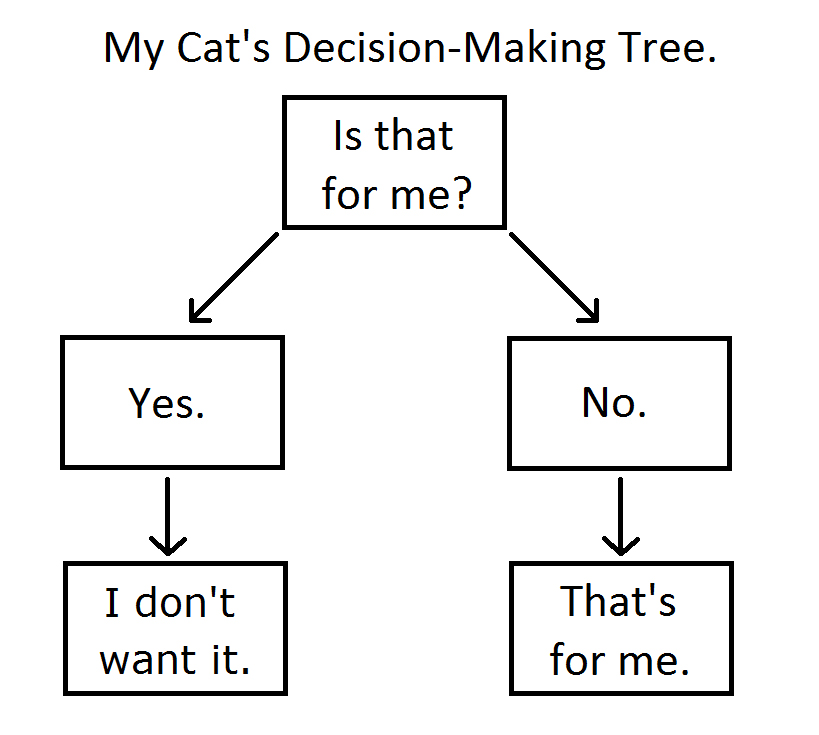
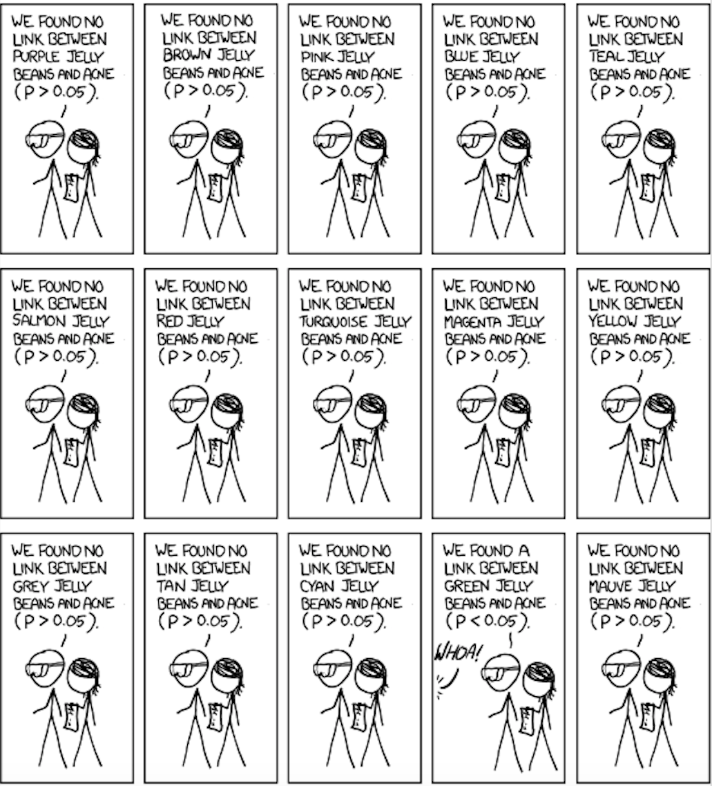
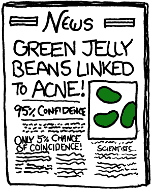

```{r, eval=TRUE, include=TRUE, echo=FALSE, message=FALSE, warning=FALSE}
# regarding `library()`: you don't have to `library(knitr)` if you `knitr::`
knitr::opts_chunk$set(eval=TRUE, include=TRUE, echo=TRUE, message=FALSE, warning=FALSE)

# knitting will default to pdf (rather than, e.g., html)
knitr::opts_chunk$set(dev='pdf')

# Defines a new code chunk `parameter=argument` option which will allow the
# size of printed code+output to be controlled using latex text size names:
# https://www.overleaf.com/learn/latex/Font_sizes%2C_families%2C_and_styles#Reference_guide
def.chunk.hook  <- knitr::knit_hooks$get("chunk")
knitr::knit_hooks$set(chunk = function(x, options) {
  x <- def.chunk.hook(x, options)
  ifelse(options$size != "normalsize", paste0("\n \\", options$size,"\n\n", x, "\n\n \\normalsize"), x)
})

color_block = function(color) {
  function(x, options) sprintf('\\color{%s}\\begin{verbatim}%s\\end{verbatim}',
                               color, x)
}
knitr::knit_hooks$set(message = color_block('red'))
knitr::knit_hooks$set(warning = color_block('red'))
knitr::knit_hooks$set(error = color_block('red'))
```

## Decision Trees

```{r, eval=FALSE, include=FALSE}
download.file(url = "https://www.trenchlesspedia.com/images/uploads/the-harmful-effects-of-tree-root-infiltration-on-potable-water-piping_.jpg",
              destfile = "images/tree.jpg", mode = 'wb')

download.file(url = "https://www.insperity.com/wp-content/uploads/decision_making_process_1200x630-1.png",
              destfile = "images/dt.png", mode = 'wb')

download.file(url = "https://thumbs.dreamstime.com/b/judge-gavel-isolated-white-single-judge-wooden-gavel-isolated-white-background-113592786.jpg",
              destfile = "images/judge.jpg", mode = 'wb')
```

\vspace{-1in}

\includegraphics[width=.9\textwidth]{images/tree.jpg}

\vspace{-3in}

:::columns
::::column

::::
::::column

\includegraphics[trim=0 0 0 50, clip, width=\textwidth]{images/judge.jpg}

::::
:::


## Decision Trees


## Binary Classification Decision Trees

```{r, eval=FALSE, include=FALSE}
download.file(url = "https://laughingsquid.com/wp-content/uploads/cat-decision.jpg",
              destfile = "images/cat.jpg", mode = 'wb')
```

:::columns
::::column

| |
|-|
|{height=3in}|

::::
::::column

### Statistical Inference

- Hypothesis Testing
  - One sample simulation p-values
  - Two sample permutation p-values
  
- Estimation
  - Bootstrap Confidence Intervals

- Prediction

  - Simple Linear Regression: real-valued outcome predictions with one predictor
  - Multivariate Linear Regression: real-valued outcome predictions with many predictors
  - **Classification**: class prediction with many predictors
  
::::
:::

## Statistics and Data Science 

:::columns
::::column

### Statistics: Inference

- Hypothesis Testing
- Estimation (Confidence Intervals)

::::
::::column

### Data Science: Machine Learning


- Prediction

  - Regression $\quad\bullet$ Classification

::::
:::

\vspace{.25cm}
- Hypothesis Testing and Estimation are both aspects of 

  \vspace{-.25cm}
  Simple Linear and Multivariate Regression

  \vspace{-.1cm}
  - The same is true for a related Classification method called Logistic Regression

\vspace{.25cm}
- Our Machine Learning (ML) focus is on the Decision Tree Classification

  - but there are many other ML Classification methods
  
    \vspace{-.25cm}
    and also many ML Regression methods beyond 
  
    \vspace{-.25cm}
    Simple Linear and Multivariate Regression models from Statistics


## Trouble Sleeping?

```{r, size="footnotesize"}
# https://cran.r-project.org/web/packages/NHANES/NHANES.pdf 
# Random sample of n=2500 observations from the
# US National Health and Nutrition Examination Study (NHANES)
library(tidyverse); NHANES <- read_csv("NHANES_data.csv")
NHANES %>% select(Age, Race3, Work, DaysMentHlthBad, DaysPhysHlthBad,
                  Depressed, SleepHrsNight, SleepTrouble) %>% glimpse()
```

## Who reports sleep trouble?

\vspace{-1in}

```{r, size="small", fig.width=8, fig.height=3.25}
library(rpart) #install.packages("rpart") # for the `rpart()` function
tree <- rpart(SleepTrouble ~ SleepHrsNight + DaysPhysHlthBad, data=NHANES)
library(partykit) #install.packages("partykit") for `as.party()` & `plot()`
plot(as.party(tree), gp=gpar(cex=1), type="simple")
```

\vspace{-2.35in}

Very similar to\hspace{1.75in}Data is "recursively partitioned" --

\vspace{-.2cm}
Linear Regression?$\;$\hspace{1.45in}divided into smaller and smaller subsets...


## Geometric Interpretation

\begin{block}{Data is "recursively partitioned"}
Divided into smaller and smaller subsets...
\end{block}

:::columns
::::column

```{r, echo=FALSE, fig.width=6, fig.height=5}
plot(as.party(tree), type="extended")
```

::::
::::column

```{r, echo=FALSE, fig.width=5, fig.height=4}
set.seed(123); NHANES %>% ggplot(aes(
  x=SleepHrsNight, y=DaysPhysHlthBad, color=SleepTrouble)) +
geom_point(alpha=0.3, cex=1.5,
  position=position_jitter(width = 0, height = 0.5)) +
  geom_vline(xintercept = 5.892, col="black", lwd=2) +
  geom_segment(x=0, xend=5.892, y=8.5, yend=8.5, col="black", lwd=2) +
  theme(text=element_text(size=20), legend.position="bottom")
```

::::
:::

## Who reports sleep trouble?

\vspace{-1.25in}


```{r, size="small", , fig.width=8, fig.height=4}
plot(as.party(tree), type="extended")
```

\vspace{-3in}

$\;$\hspace{2.5in}What is the root note? What's in oval nodes?

\vspace{-.2cm}
$\;$\hspace{2.5in}What are child/parent, leaf/terminal nodes?

\vspace{-.2cm}
$\;$\hspace{2.5in}What are the decision rules and where are they?


## What kind of things could be different here?

\vspace{.25cm}

```{r, size="small", , fig.width=8, fig.height=3}
plot(as.party(tree), gp=gpar(cex=1), type="simple")
```

\vspace{-.5cm}

**Does someone have having trouble sleeping if** 

\vspace{-.25cm}

- they typically gets 5.2 hours of sleep on weeknights
- report having 4 days of poor physical health over the past month **?**

## What kind of things could be different here?

### Nonstandard Binary Classification Decision Trees?

- Why are there two branches only?
- Why are decision rules only a single cutoff?
- Why are decision rules based on one variable only?
- Are "composite" decision rules possible? 

  How would we use a nonbinary categorical variable?

:::columns
::::column

```{r, eval=FALSE, size="footnotesize"}
MaritalStatus <- 
  as.factor(NHANES$MaritalStatus)

MaritalStatus2 <- 
  as.numeric(MaritalStatus)

tibble(level_text=MaritalStatus, 
       level_numeric=MaritalStatus2) %>% 
  unique() %>% arrange(level_numeric)
```

::::
::::column

```{r, echo=FALSE, size="small"}
categorical <- as.factor(NHANES$MaritalStatus)
tibble(level_text = categorical, 
       level_numeric = as.numeric(categorical)) %>% 
  unique() %>% arrange(level_numeric)
```

::::
:::

## How are decision trees constructed?

1. All possible **variables** and all their possible **decision rules** are considered

   - Each **variable** and **decision rule** creates two new child nodes

2. All **variable** and **decision rule** violating **stopping rule** are discarded

   - node must be large enough to split, resulting nodes must be large enough
   - maximum tree depth, and maximum node count must not be exceeded

3. Of those remaining, the **variable** and **decision rule** producing the lowest *entropy*/*gini impurity* nodes is selected (for possible addition into the tree)

   $\bullet\;\text{entroy}(p) = - p \log(p) - (1 - p) \log(1-p) \quad \bullet\;\text{gini}(p) = 1 - p^2 - (1 - p)^2$ 

   \vspace{-.2cm}   
   
   \textcolor{gray}{(\emph{entropy} and \emph{gini impurity} are highest if $p=0.5$ and lowest if $p=1$ or $p=0$)}

4.  A **variable** and **decision rule** giving "sufficient improvement" is added to the tree

      \vspace{-.2cm}   

    - The `cp` parameter in the `rpart()` function defines "sufficient improvement":

      \vspace{-.2cm}   
      [$\text{Error}(T) + \texttt{cp} \times \text{splits} \times \text{Error}(T_0)$](https://cran.r-project.org/web/packages/rpart/vignettes/longintro.pdf) must improve  ($T_0$ is the no splits tree) 


## How are decision trees evaluated?

The outcome/response $y_i$ (and hence $\hat y$) is re-coded as $0$ (negative) or $1$ (positive)

\vspace{-.2cm}

- $\hat y$ either *predicts* or *does not predict* the positive event
- $\hat y$ for "Do you have sleep trouble? Yes or No?" is $1$ if "Yes" is predicted

\vspace{.1cm}

\begin{tabular}{llll}
1.& Accuracy: & $\frac{\sum_{i=1}^n 1_{y_i}(\hat y_i)}{n}$ & $\text{ where } \quad 1_{y_i}(\hat y_i)=1 \text{ if } \hat y_i=y_i$\\
2. & Precision: & $\frac{\sum_{i=1}^n 1_{y_i}(\hat y_i) \times 1_{1}(\hat y_i)}{\sum_{i=1}^n \hat y_i}$&$\text{ where } \quad 1_{1}(\hat y_i)=1 \text{ if } \hat y_i=1$ \\
3. &Sensitivity/Recall: &$\frac{\sum_{i=1}^n 1_{y_i}(\hat y_i) \times 1_{1}(\hat y_i)}{\sum_{i=1}^n y_i}$\\
4. &Specificity: &$\frac{\sum_{i=1}^n 1_{y_i}(\hat y_i) \times 1_{0}(\hat y_i)}{\sum_{i=1}^n (1- y_i)}$&$\text{ where } \quad 1_{0}(\hat y_i)=1 \text{ if } \hat y_i=0$\\
\end{tabular}

\color{gray}
For even more versions see: https://en.wikipedia.org/wiki/Sensitivity_and_specificity
\color{black}

### What is the meaning of Accuracy, Precision, Sensitivity/Recall, and Specificity?

What do the expressions mean? $\sum_{i=1}^n y_i$, $\sum_{i=1}^n (1- y_i)$, $\sum_{i=1}^n 1_{y_i}(\hat y_i) \times 1_{1}(\hat y_i)$, etc.?


## How are decision trees evaluated?

The outcome/response $y_i$ (and hence $\hat y$) is re-coded as $0$ (negative) or $1$ (positive)

\vspace{-.2cm}

- $\hat y$ either *predicts* or *does not predict* the positive event
- $\hat y$ for "Do you have sleep trouble? Yes or No?" is $1$ if "Yes" is predicted

\vspace{.1cm}

### TP, TN, FP, FN, and Confusion Matrices -- What are each of these things?

:::columns
::::column

| | $y_i=0$ | $y_i=1$ | 
|-|-|-|
| $\hat y_i=0$ | $n_{\text{TN}}$ | $n_{\text{FN}}$ |
| $\hat y_i=1$ | $n_{\text{FP}}$ | $n_{\text{FN}}$ |

| |
|-|
| $n = n_{\text{TN}} + n_{\text{FN}} + n_{\text{FP}} + n_{\text{FN}}$ |

::::
::::column

| | $y_i=0$ | $y_i=1$ | 
|-|:-:|:-:|
| $\hat y_i=0$ |  $\checkmark$ | $\times$ |
| $\hat y_i=1$ | $\times$ |  $\checkmark$ |

This is like *Type I* and *Type II* errors $\quad$ from the *Hypothesis Testing* context!

::::
:::

\vspace{.5cm}
- What do FP, FN, TP, or TN predictions mean practically in different contexts? 

## How are decision trees evaluated?

The outcome/response $y_i$ (and hence $\hat y$) is re-coded as $0$ (negative) or $1$ (positive)

\vspace{-.2cm}

- $\hat y$ either *predicts* or *does not predict* the positive event
- $\hat y$ for "Do you have sleep trouble? Yes or No?" is $1$ if "Yes" is predicted

\vspace{.1cm}

### TP, TN, FP, FN, and Confusion Matrices -- What are each of these things?

:::columns
::::column

| | $y_i=0$ | $y_i=1$ | 
|-|-|-|
| $\hat y_i=0$ | $n_{\text{TN}}$ | $n_{\text{FN}}$ |
| $\hat y_i=1$ | $n_{\text{FP}}$ | $n_{\text{FN}}$ |

| |
|-|
| $n = n_{\text{TN}} + n_{\text{FN}} + n_{\text{FP}} + n_{\text{FN}}$ |

::::
::::column

| | |
|-|-|
| 1. Accuracy: | $\frac{n_\text{TP}+n_\text{TN}}{n}$ |
| | |
| 2. Precision: | $\frac{n_\text{TP}}{n_\text{TP}+n_\text{FP}}$ |
| | |
| 3. Sensitivity/Recall: | $\frac{n_\text{TP}}{n_\text{TP}+n_\text{FN}}$ |
| | |
| 4. Specificity: | $\frac{n_\text{TN}}{n_\text{TN}+n_\text{FP}}$ |

::::
:::

\vspace{.5cm}
\color{gray}
For more information see: https://en.wikipedia.org/wiki/Confusion_matrix#Example
\color{black}


## What's Worse? FN or FP?

```{r, eval=FALSE, include=FALSE}
download.file(url = "http://www.bccancer.bc.ca/news-site/PublishingImages/20170717_Infographic%20-%20all%203%20screening%20programs_V03-01.jpg",
              destfile = "images/cancer.jpg", mode = 'wb')
download.file(url = "https://loanscanada.ca/wp-content/uploads/2016/04/116567372-1.jpg",
              destfile = "images/loan.jpg", mode = 'wb')
download.file(url = "https://d2v9ipibika81v.cloudfront.net/uploads/sites/22/covid-test-2-1140x684.jpg",
              destfile = "images/covid.jpg", mode = 'wb')
```

:::columns
::::column

 

Is it more costly to wrongly ignore cancer (FN)?

::::

::::column

\includegraphics[trim=0 77 0 77,clip,width=\textwidth]{images/loan.jpg}

Is it more costly to approve bad applicants (FP)?

::::
:::


## What's Worse? FN or FP?


:::columns
::::column

Sometimes it's not immediately clear which 
may be better or worse

\vspace{.25cm}
Regarding self-quarantine, some questions

\vspace{.15cm}

- Does FN 

  meaningfully increase transmission? 
  
- Does FP 

  meaningfully decrease well-being? 

\vspace{.25cm}
Regarding hospitalization, some questions

\vspace{.15cm}

- Does FN 

  significantly worsen outcomes?
  
- Does FP 

  prohibitively burden medical care?

::::

::::column


This depends on the costs and benefits of the intervention/failure to intervene

::::
:::


## What's Worse? FN or FP?


- **Sensitivity/Recall** is also called the **True Positive Rate (TPR)**
  - The **FALSE Positive Rate (FPR)** is 1-TPR
  
    FPR tells you the proportion of positives that are missed


- **Specificity** is also called the **True Negative Rate (TPR)**
  - The **FALSE Negative Rate (FNR)** is 1-TNR

    FNR tells you the proportion of negatives that are missed

\color{gray}
For more information see: https://en.wikipedia.org/wiki/Confusion_matrix#Example
\color{black}


## How are decision trees evaluated?

1. Decide what matters: accuracy, precision, sensitivity/recall, or specificity?
  
   Accuracy is often a good choice, but not for some **class imbalance** contexts
   
   - If you care about FP but they're rare, then accuracy overemphasizes FN
     - If most predictions are negative, then most errors are FN, so FN drives accuracy...
   - If you care about FN but they're rare, then accuracy overemphasizes FP
     - If most predictions are positive, then most errors are FP, so FP drives accuracy...

2. Use the 80-20 train-test split methodology to compare competing models

    - Build the classification model with 80% of the data
    - Score the predictions on the remaining 20% of the data
    - This suggests how well a model will actually generalize and perform on new data


## Review: The 80/20 Train-Test Split

- Classification is about doing something (predicting) in the sample
- *So you should try to see how well you can do that thing in the population...*

\begin{minipage}[t]{0.4\linewidth}
```{r, eval=FALSE, include=FALSE}
download.file(url = "https://blogs.gartner.com/jitendra-subramanyam/files/2019/07/two-samples-from-population.png",
              destfile = "images/2sample.png", mode = 'wb')
```
\includegraphics[trim=70 85 0 0, clip, width=\textwidth]{images/2sample.png}

\vspace{-.15in}
$\,$Sample $\;\;$ (split in two, say 80/20)

\end{minipage}\hfill
\begin{minipage}[t]{0.59\linewidth}

\vspace{-2.275in}

\textbf{$\leftarrow$ Here we split a "representative" population}

\hspace{.2in}\textbf{sample into two "representative" samples}

\footnotesize 

\begin{enumerate}
\item You fit the model based on a "representative" sample
\item So subsamples are "representative of the population"
\item Use 80\% of the data to fit the "representative" model
\item Use 20\% to see if the model's actually "representative"
\end{enumerate}

\normalsize

\textbf{This strategy shows when the model for 80\% of the data
doesn't work well for the remaing 20\% of the data, which could happen if}

\small 

\begin{itemize}
\item The subsample aren't "representative" to begin with
\item The model is overly specific to 80\% of the data
\end{itemize}

\end{minipage}


## Review: The 80/20 Train-Test Split

\vspace{.2cm}

\begin{block}{Fit a model on 80\% of the data $\rightarrow$ "score" the model on the remaining 20\%}
\begin{itemize}
\item The train-test method is a wonderful tool in LARGE data contexts
\begin{itemize}
\item when there's enough data so the random train-test split isn't just "lucky"
\end{itemize}
\item In its more advanced (data science) forms, train-test is a powerful model tuning tool
\end{itemize}
\end{block}

\vspace{-.4cm}

:::columns
::::column

\vspace{-.15cm}

| | |
|-|-|
| {height=175px} | {height=175px} |

```{r, eval=FALSE, include=FALSE}
download.file(url = "https://images.squarespace-cdn.com/content/v1/5435e221e4b083e263348982/1530318848971-DLPU4NUCEW5X75NCE8S3/Jelly-beans-p-value+2.png",
              destfile = "images/jb1.png", mode = 'wb')
download.file(url = "https://images.squarespace-cdn.com/content/v1/5435e221e4b083e263348982/1530314928700-5K6MR0HDAJ26VY9J2TNL/Jelly-beans-p-value.png",
              destfile = "images/jb2.png", mode = 'wb')
```

::::
::::column

\vspace{.5cm}
$\quad\quad\quad \bullet$ Like Hypothesis Testing, it is  
$\quad\quad\quad\;\;\;$ subject to "random chance"   
$\quad\quad\quad\;\;\;$ (of the test-train split)   
$\quad\quad\quad \bullet$ Unlike Hypothesis Testing, it is  
$\quad\quad\quad\;\;\;$ based on observed out of sample  
$\quad\quad\quad\;\;\;$ generalizability, rather than tests   
$\quad\quad\quad\;\;\;$ based on modeling assumptions  
$\quad\quad\quad \bullet$ It's not about parameters or  
$\quad\quad\quad\;\;$ 'right' or 'wrong', but picking  
$\quad\quad\quad\;\;$ models predicting new data 'well'    
::::
:::


## Trouble Sleeping: 80-20 Train-Test Split 

:::columns
::::column

```{r}
NHANES %>% rowid_to_column() ->
  NHANES; n <- nrow(NHANES)
set.seed(1002); train_ids <- 
  sample(1:n, size=round(0.8*n)) 
train <- NHANES %>% 
  filter(rowid %in% train_ids)
test <- NHANES %>% 
  filter(!(rowid %in% train_ids))
```
```{r, eval=FALSE}
tree <- rpart(SleepTrouble ~ 
  SleepHrsNight + DaysPhysHlthBad, 
  data=train) 
tree %>% as.party() %>% 
plot(type="extended",#gp=gpar(cex=0.8),
     tp_args=list(id=FALSE))
```

::::
::::column

<!-- https://stackoverflow.com/questions/61472081/terminal-panel-partykit-r-node-id-plots-object-info --> 

```{r, echo=FALSE, fig.width=4.5, fig.height=5}
tree <- rpart(SleepTrouble ~ 
  SleepHrsNight + DaysPhysHlthBad, 
  data=train) 
tree %>% as.party() %>% 
plot(type="extended",#gp=gpar(cex=0.8),
     tp_args=list(id=FALSE))
```

::::
:::

## Trouble Sleeping: Confusion Matrices 

:::columns
::::column

```{r, size="footnotesize"}
tree_train_pred <- predict(
  tree, type="class") 
train_conf_mtrx <- table(
  `y-hat`=tree_train_pred, 
 ` observed y`=train$SleepTrouble)
train_conf_mtrx
train_conf_mtrx/sum(train_conf_mtrx)
```

::::
::::column

```{r, size="footnotesize"}
tree_test_pred <- predict(
  tree, type="class", newdata=test)
test_conf_mtrx <- table(
  `y-hat`=tree_test_pred, 
 ` observed y`=test$SleepTrouble)
test_conf_mtrx
test_conf_mtrx/sum(test_conf_mtrx)
```

::::
:::

## Trouble Sleeping: Metrics (Accuracy, etc.)

:::columns
::::column

```{r, size="footnotesize"}
n_TN <- train_conf_mtrx[1,1]
n_FN <- train_conf_mtrx[1,2]
n_FP <- train_conf_mtrx[2,1]
n_TP <- train_conf_mtrx[2,2]
# accuracy
(n_TP+n_TN)/sum(train_conf_mtrx)
# precision
(n_TP)/(n_TP+n_FP)
# sensitivity/recall: TPR = 1-FPR
(n_TP)/(n_TP+n_FN)
# specificity: TNR = 1-FNR
(n_TN)/(n_TN+n_FP)
```

::::
::::column

```{r, size="footnotesize"}
n_TN <- test_conf_mtrx[1,1]
n_FN <- test_conf_mtrx[1,2]
n_FP <- test_conf_mtrx[2,1]
n_TP <- test_conf_mtrx[2,2]
# accuracy
(n_TP+n_TN)/sum(test_conf_mtrx)
# precision
(n_TP)/(n_TP+n_FP)
# sensitivity/recall: TPR = 1-FPR
(n_TP)/(n_TP+n_FN)
# specificity: TNR = 1-FNR
(n_TN)/(n_TN+n_FP)
```

::::
:::

## Trouble Sleeping: Comparing Models

:::columns
::::column

<!-- https://stats.stackexchange.com/questions/219651/plot-a-subtree-from-a-big-decision-tree -->
<!-- https://stackoverflow.com/questions/30644908/modifying-terminal-node-in-ctree-partykit-package -->
<!-- https://stackoverflow.com/questions/34581975/changing-node-box-size-in-partykit -->

```{r, size="tiny", fig.height=5, fig.width=6}
tree1 <- rpart(SleepTrouble~SleepHrsNight+DaysPhysHlthBad, 
               data=train)
tree1 %>% as.party() %>% plot(type="simple", 
  tp_args = list(FUN = function(info) 
  list(format(info$prediction), format(paste("n =",info$n)), 
       format(paste(round(info$err,1),"% err",sep="")))))
```

::::
::::column

```{r, size="tiny", fig.height=10, fig.width=12}
tree2 <- rpart(SleepTrouble ~ ., data=train)
tree2 %>% as.party() %>% plot(type="simple", 
  ep_args = list(justmin=15),
  tp_args = list(FUN = function(info) 
  list(format(info$prediction), format(paste("n =",info$n)), 
       format(paste(round(info$err,1),"% err",sep="")))))
```

::::
:::

## Trouble Sleeping: Comparing Models

### Let's just compare the out of sample generalizability

:::columns
::::column

```{r, size="footnotesize"}
tree1_test_pred <- 
  predict(tree1, type="class", 
          newdata=test)
tree1_test_confmtrx <- 
  table(`y-hat`=tree1_test_pred, 
       ` observed y`=test$SleepTrouble)
tree1_test_confmtrx
# accuracy
n <- sum(tree1_test_confmtrx)
sum(diag(tree1_test_confmtrx))/n
```

::::
::::column

```{r, size="footnotesize"}
tree2_test_pred <- 
  predict(tree2, type="class", 
          newdata=test)
tree2_test_confmtrx <- 
  table(`y-hat`=tree2_test_pred, 
       ` observed y`=test$SleepTrouble)
tree2_test_confmtrx
# accuracy
n <- sum(tree2_test_confmtrx)
sum(diag(tree2_test_confmtrx))/n
```

::::
:::


## Trouble Sleeping: Comparing Models

### Let's just compare the out of sample generalizability

:::columns
::::column

```{r, size="footnotesize"}
tree1_test_pred <- 
  predict(tree1, type="class", 
          newdata=test)
tree1_test_confmtrx <- 
  table(`y-hat`=tree1_test_pred, 
       ` observed y`=test$SleepTrouble)
tree1_test_confmtrx/sum(tree1_test_confmtrx)
# accuracy
n <- sum(tree1_test_confmtrx)
sum(diag(tree1_test_confmtrx))/n
```

::::
::::column

```{r, size="footnotesize"}
tree2_test_pred <- 
  predict(tree2, type="class", 
          newdata=test)
tree2_test_confmtrx <- 
  table(`y-hat`=tree2_test_pred, 
       ` observed y`=test$SleepTrouble)
tree2_test_confmtrx/sum(tree2_test_confmtrx)
# accuracy
n <- sum(tree2_test_confmtrx)
sum(diag(tree2_test_confmtrx))/n
```

::::
:::

## Trouble Sleeping: Comparing Models

:::columns
::::column

```{r, size="footnotesize"}
n_TN <- tree1_test_confmtrx[1,1]
n_FN <- tree1_test_confmtrx[1,2]
n_FP <- tree1_test_confmtrx[2,1]
n_TP <- tree1_test_confmtrx[2,2]
# accuracy
(n_TP+n_TN)/sum(tree1_test_confmtrx)
# precision
(n_TP)/(n_TP+n_FP)
# sensitivity/recall: TPR = 1-FPR
(n_TP)/(n_TP+n_FN)
# specificity: TNR = 1-FNR
(n_TN)/(n_TN+n_FP)
```

::::
::::column

```{r, size="footnotesize"}
n_TN <- tree2_test_confmtrx[1,1]
n_FN <- tree2_test_confmtrx[1,2]
n_FP <- tree2_test_confmtrx[2,1]
n_TP <- tree2_test_confmtrx[2,2]
# accuracy
(n_TP+n_TN)/sum(tree2_test_confmtrx)
# precision
(n_TP)/(n_TP+n_FP)
# sensitivity/recall: TPR = 1-FPR
(n_TP)/(n_TP+n_FN)
# specificity: TNR = 1-FNR
(n_TN)/(n_TN+n_FP)
```

::::
:::

## Comparing Models

Which of the two models above do we prefer? \color{gray}[Use generalizability on *test* data...]\color{black}

### How to choose between models: Rationale 1

- If a FP is costly, then low FPR (high sensitivity/recall) is important
  - sensitivity/recall = TPR = 1-FPR
- If a FN is costly, then low FNR (high specificity) is important
  - specificity = TNR = 1-TNR
- Accuracy is a weighted average of sensitivity/recall and specificity
  - sensitivity/recall gets more weight if positive outcomes are more prevalent
  - specificity gets more weight if negative outcomes are more prevalent

### How to choose between models: Rationale 2

- Less complex models are less likely to overfit the data
  - Less complex model performance tends to generalize better 
- Less complex models tends be easier to interpret than more complex models


## Multi-Class (Non-Binary) Outcomes


:::columns
::::column

```{r, size="small", eval=FALSE}
tree <- rpart(Education~., 
  data=NHANES)
```

::::
::::column

```{r, size="tiny", eval=FALSE}
plot(as.party(tree), type="simple", 
  ep_args = list(justmin=15),
  tp_args = list(id=FALSE, FUN = function(info) list(
    format(info$prediction), format(paste("n =",info$n)), 
    format(paste(round(info$err,1),"% err",sep="")))))
```

::::
:::

\vspace{-.66in}

```{r, echo=FALSE, fig.width=15, fig.height=7.5}
tree <- rpart(Education ~ ., data=NHANES)
tree %>% as.party() %>% plot(type="simple", ep_args = list(justmin=15),
  tp_args = list(id=FALSE, FUN = function(info) list(
    format(info$prediction), format(paste("n =",info$n)), 
    format(paste(round(info$err,1),"% err",sep="")))))
```

\vspace{-1in}

```{r, size="scriptsize", echo=FALSE}
tree_test_pred <- predict(tree, type="class", newdata=test)
table(`y-hat`=tree_test_pred, 
     ` observed y`=test$Education) -> tmp
colnames(tmp) <- c("8th", "9-11th", "Col Grad", "HS Grad", "Some Col")
tmp
```

## Controlling FP and FN with Thresholding

\vspace{-.1in}

:::columns
::::column

```{r, size="footnotesize"}
tree2_test_pred <- 
  predict(tree2, type="class", 
          newdata=test)
  table(`y-hat`=tree2_test_pred, 
       ` observed y`=test$SleepTrouble)
predict(tree2, newdata=test) %>% 
  as_tibble() -> tree2_test_pred
tree2_test_pred %>% head(3)
```

\vspace{-2in}
$\quad\quad\quad\quad\quad\quad\quad\quad\quad\quad\quad\quad$FPR: 8%

$\quad\quad\quad\quad\quad\quad\quad\quad\quad\quad\quad\quad$TPR: 24%

::::
::::column

```{r, size="footnotesize"}
threshold_20 <- tree2_test_pred %>% 
  mutate(prediction=ifelse(
    Yes>=0.20, "Yes", "No"))
table(`y-hat`=threshold_20$prediction, 
       ` observed y`=test$SleepTrouble)
threshold_70 <- tree2_test_pred %>% 
  mutate(prediction=ifelse(
    Yes>=0.70, "Yes", "No"))
table(`y-hat`=threshold_70$prediction, 
       ` observed y`=test$SleepTrouble)
```
\vspace{-2in}
$\quad\quad\quad\quad\quad\quad\quad\quad\quad\quad\quad\quad$FPR: 25%

$\quad\quad\quad\quad\quad\quad\quad\quad\quad\quad\quad\quad$TPR: 38%

\vspace{1.15in}
$\quad\quad\quad\quad\quad\quad\quad\quad\quad\quad\quad\quad$FPR: 5%

$\quad\quad\quad\quad\quad\quad\quad\quad\quad\quad\quad\quad$TPR: 17%

::::
:::

<!-- Nathan's slides have an interesting worked example -->
<!-- I like the idea but I think I'll be more code centric as it currently stands -->
